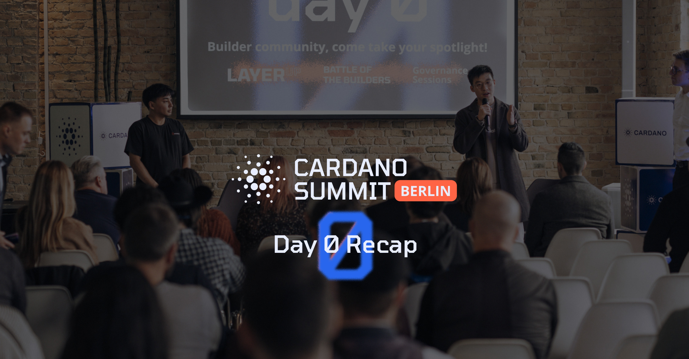

On November 11, 2025, the Cardano Foundation recapped "Day Zero" of the Cardano Summit in Berlin. Hosted at w3.hub, the event gathered over 475 builders and developers for collaboration and innovation. Highlights included governance workshops, the "Layer Up Hackathon" finale, and the "Battle of the Builders" pitch competition with ten finalists. The day set a vibrant, community-driven tone for the main enterprise summit.

 [**Read more**](https://cardanofoundation.org/blog/summit-2025-day-zero-recap) 

 

