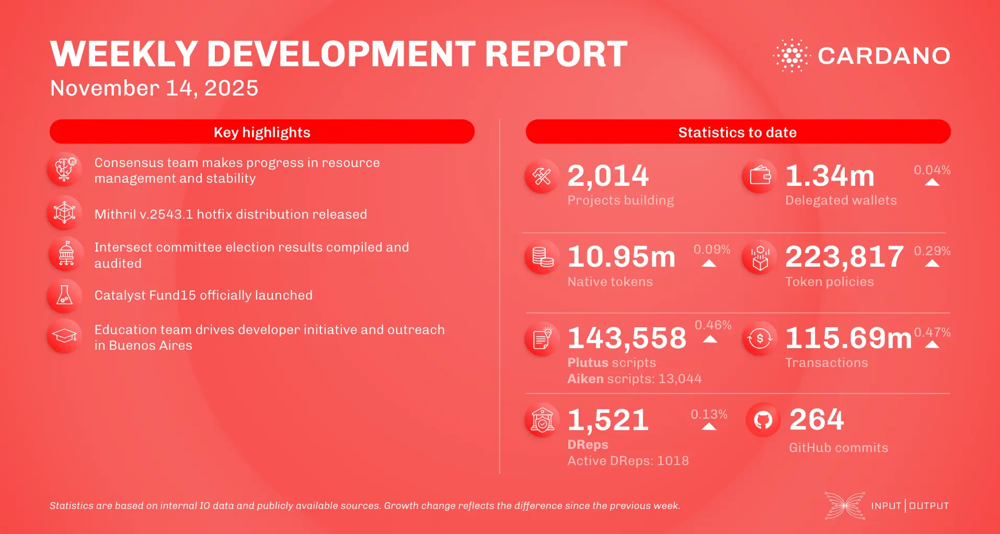

The November 14, 2025, development report highlights the consensus team addressing 'bufferbloat' issues from the Leios demo and enhancing resource management. Scaling updates include Mithril releasing hotfix 2543.1 and Hydra improving partial fanout and introducing 'SafeClose' safety features. Intersect announced election results with high turnout. Project Catalyst Fund15 launched, introducing a new "Midnight: Compact DApps" category alongside three Cardano-focused funding tracks. The education team is conducting a developer course in Buenos Aires.

 [**Read more**](https://www.essentialcardano.io/development-update/weekly-development-report-as-of-2025-11-14) 

 

