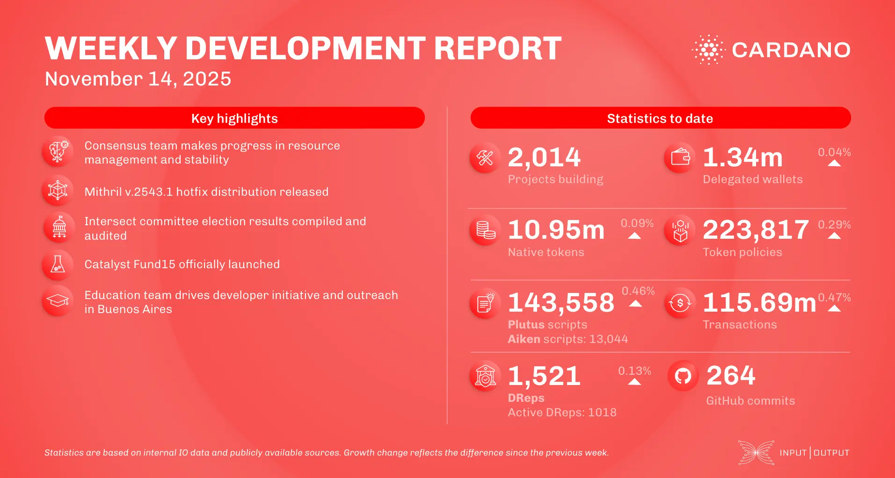

The consensus team addressed 'bufferbloat' issues and enhanced resource management following the Leios demo. Scaling updates include Mithril hotfix 2543.1 and Hydra's introduction of the 'SafeClose' safety feature alongside improved partial fanout. Intersect announced its election results following a high voter turnout, while Project Catalyst Fund15 launched with a new "Midnight: Compact DApps" category. Additionally, the education team is currently conducting a developer course in Buenos Aires.

 [**Read more**](https://www.essentialcardano.io/development-update/weekly-development-report-as-of-2025-11-14) 

 

