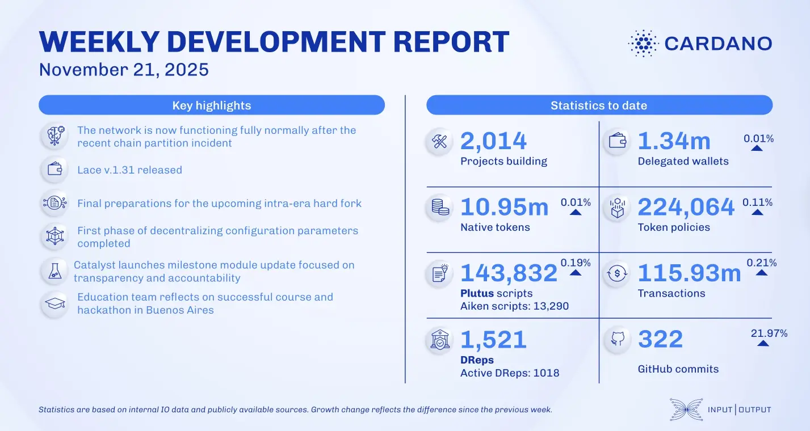

The November 21, 2025, development report highlights a mainnet chain partition caused by a malformed transaction, which was resolved with hotfix node v.10.5.3. The ledger team defined sub-transactions for the Dijkstra era, while the Plutus team finalized costing for Value primitives for the upcoming hard fork. Lace v.1.31 was released with in-wallet token swaps and Bitcoin wallet support. Mithril completed the first phase of decentralizing configuration parameters.

 [**Read more**](https://www.essentialcardano.io/development-update/weekly-development-report-as-of-2025-11-21) 

 

