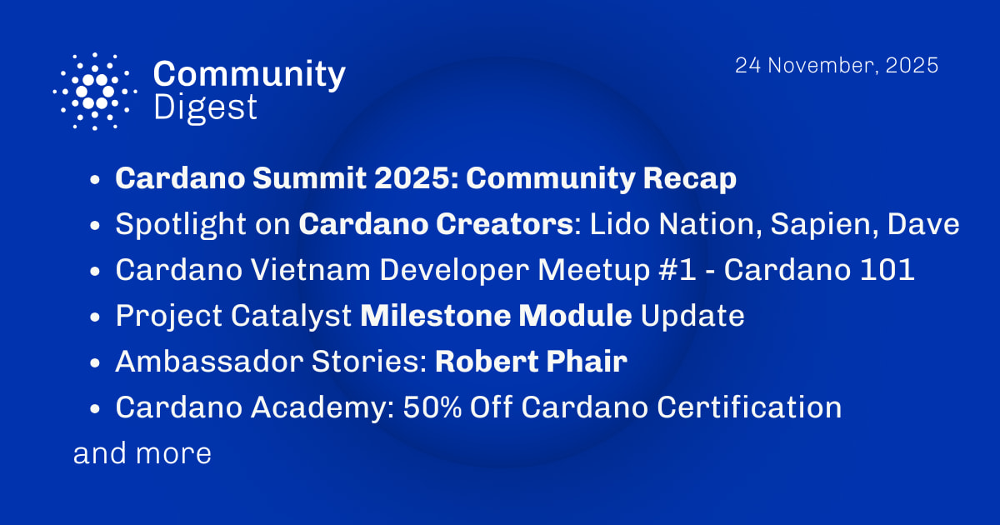

The November 24, 2025, Cardano Community Digest highlights the unforgettable Cardano Summit 2025 in Berlin, featuring community-led sessions, Roundtable Talks on culture, and content creators like Lido Nation and Sapien explaining technical concepts. The digest covers the "Cardano 101" developer meetup in Vietnam, recent updates to the Project Catalyst Milestone Module for better transparency, and Robert Phair's recognition as a new Ambassador. Additionally, Cardano Academy offers a 50% discount on certification exams.

 [**Read more**](https://forum.cardano.org/t/digest-november-24-2025-cardano-summit-2025-recap-spotlight-on-cardano-creators-cardano-vietnam-developer-meetup-project-catalyst-milestone-module-update-ambassador-stories-robert-phair-cardano-academy-50-off-cardano-certification/151457) 

 

