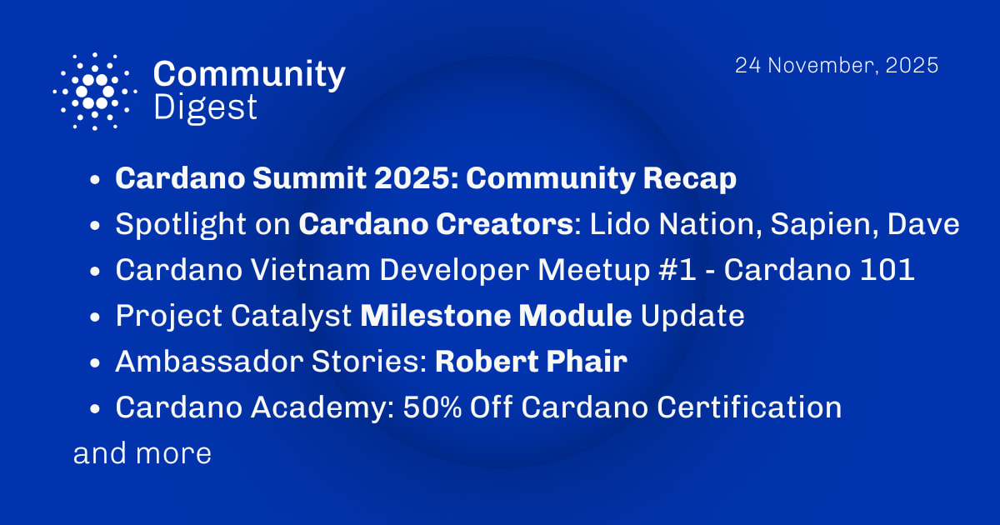

Cardano Summit 2025 in Berlin featured community-led sessions, cultural talks, and technical content from creators like Lido Nation and Sapien. Other updates include a "Cardano 101" developer meetup in Vietnam, transparency improvements to the Project Catalyst Milestone Module, and Robert Phair’s recognition as a new Ambassador. Additionally, Cardano Academy is offering a 50% discount on certification exams.

 [**Read more**](https://forum.cardano.org/t/digest-november-24-2025-cardano-summit-2025-recap-spotlight-on-cardano-creators-cardano-vietnam-developer-meetup-project-catalyst-milestone-module-update-ambassador-stories-robert-phair-cardano-academy-50-off-cardano-certification/151457) 

 

