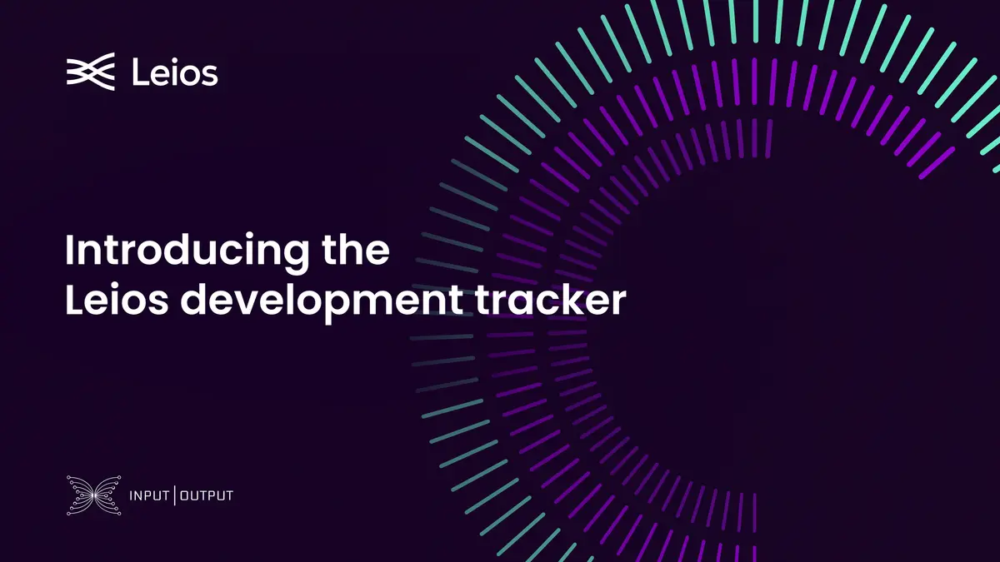

The November 26, 2025, blog post announces the launch of the Leios 24/7 development tracker by Input Output. This tool provides real-time, global visibility into the development of the Ouroboros Leios consensus protocol, showcasing key milestones, active workstreams, and contributions. The tracker highlights the "follow-the-sun" engineering model, reinforcing transparency and accountability as the project transitions from research to implementation.

 [**Read more**](https://www.iog.io/news/leios-24-7-development-tracker-launches) 

 

