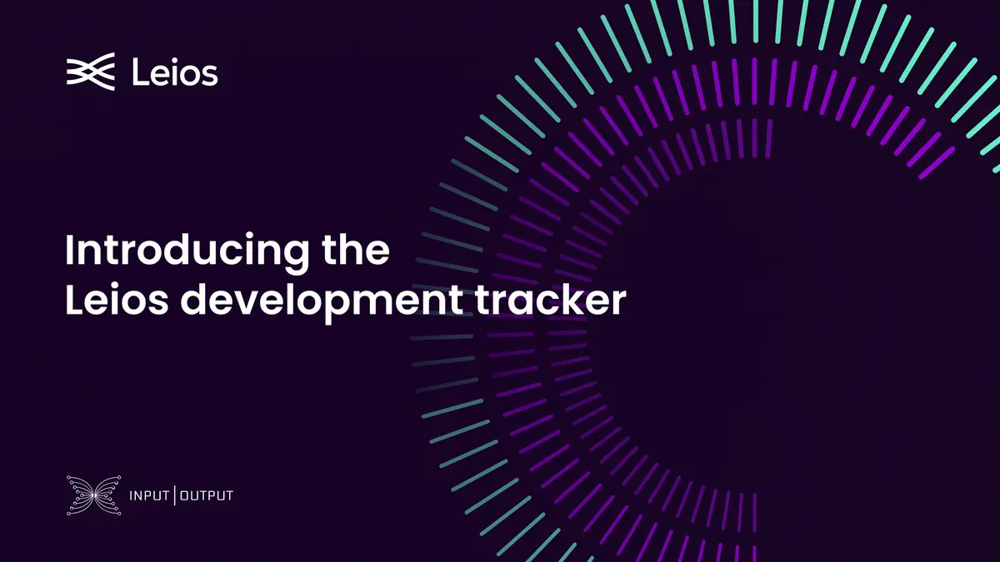

Input Output launched the Leios 24/7 development tracker, providing real-time, global visibility into the Ouroboros Leios consensus protocol. The tool showcases key milestones, active workstreams, and contributions, highlighting a "follow-the-sun" engineering model. This initiative reinforces transparency and accountability as the project transitions from research to implementation.

 [**Read more**](https://www.iog.io/news/leios-24-7-development-tracker-launches) 

 

