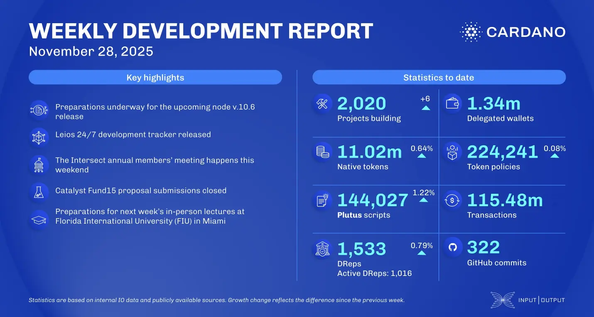

The Leios development tracker was launched to provide a consolidated view of the protocol's global progress. The networking team focused on Cardano node v.10.6, resolving cardano-tracer issues and preparing for P2P-only networking. Project Catalyst Fund15 proposal submissions have closed, and Intersect is preparing for its 24-hour virtual Annual Members' Meeting in the Virtual Hub.

 [**Read more**](https://www.essentialcardano.io/development-update/weekly-development-report-as-of-2025-11-28) 

 

