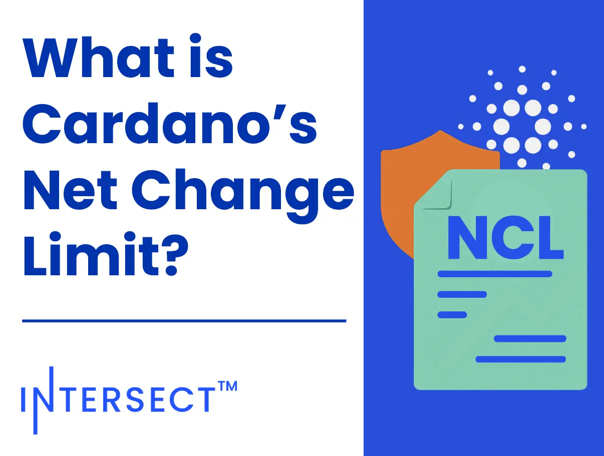

The December 02, 2025, blog post defines the Net Change Limit as a constitutional safeguard capping ada withdrawals from the treasury to ensure financial sustainability. With the current limit expiring soon, a proposal seeks a short extension to February 2026. This allows the community time to ratify a new 18-month limit and align fiscal strategies with the upcoming Cardano Vision 2030, ensuring continuous funding for ecosystem growth.

 [**Read more**](https://www.intersectmbo.org/news/what-is-cardanos-net-change-limit) 

 

