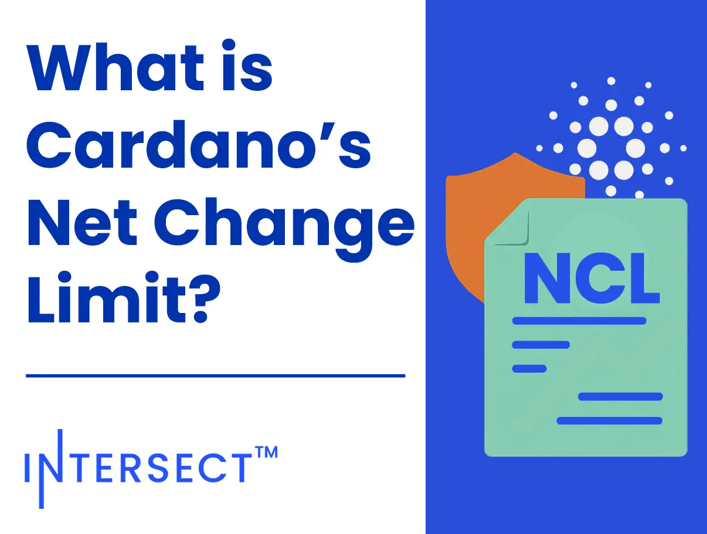

The Net Change Limit serves as a constitutional safeguard that caps ADA withdrawals from the treasury to ensure financial sustainability. A proposed short extension allows the community time to ratify a new 18-month limit and align fiscal strategies with Cardano Vision 2030, ensuring continuous funding for ecosystem growth.

 [**Read more**](https://www.intersectmbo.org/news/what-is-cardanos-net-change-limit) 

 

