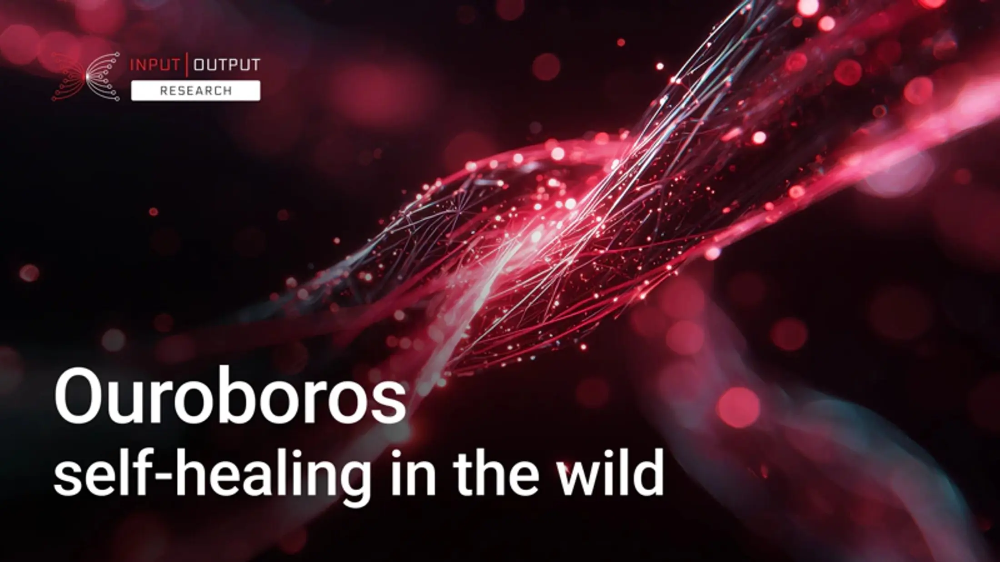

The December 03, 2025, blog post by Professor Aggelos Kiayias analyzes the recent Cardano mainnet incident, where a serialization bug caused a temporary chain split. He explains how the Ouroboros protocol's self-healing design successfully resolved the partition without central intervention. By following the longest chain rule, the network converged back to a single history once stake pool operators upgraded their nodes, demonstrating the resilience of decentralized consensus under real-world stress.

 [**Read more**](https://www.iog.io/news/ouroboros-self-healing-in-the-wild) 

 

