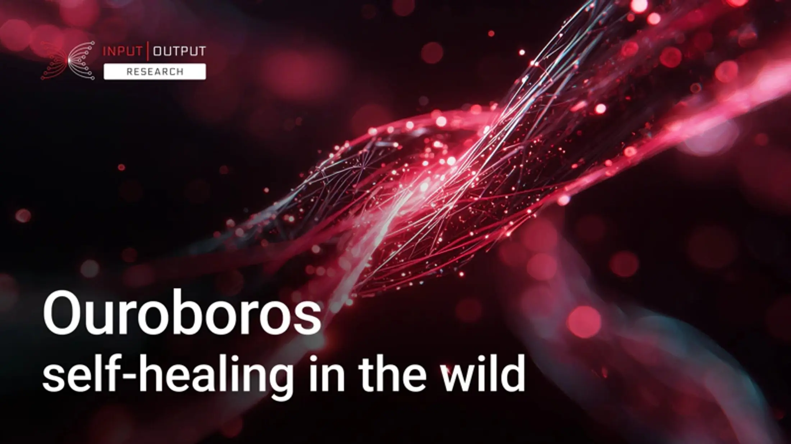

Professor Aggelos Kiayias analyzed the November 21 incident, where a serialization bug caused a temporary chain split. He explains how the Ouroboros protocol's self-healing design and longest chain rule successfully resolved the partition without central intervention. Once SPOs upgraded their nodes, the network converged back to a single history, demonstrating the resilience of decentralized consensus under real-world stress.

 [**Read more**](https://www.iog.io/news/ouroboros-self-healing-in-the-wild) 

 

