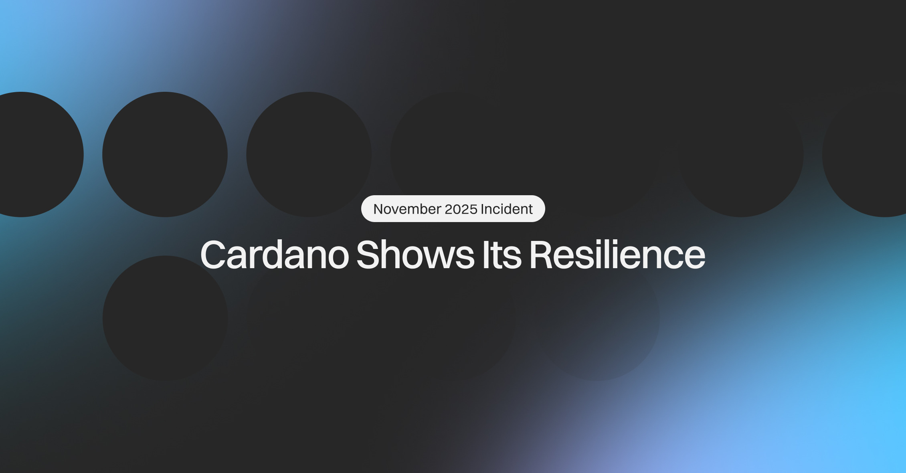

The December 04, 2025, blog post by CTO Giorgio Zinetti analyzes the November 21 network incident, where a malformed transaction caused a temporary chain partition. Despite the split, block production continued uninterrupted, and the network never went offline. A coordinated response from stake pool operators and ecosystem entities, along with the Ouroboros consensus mechanism, resolved the issue within 14 hours as the canonical chain prevailed, demonstrating Cardano's resilience and decentralization.

 [**Read more**](https://cardanofoundation.org/blog/november-2025-cardano-shows-resilience) 

 

