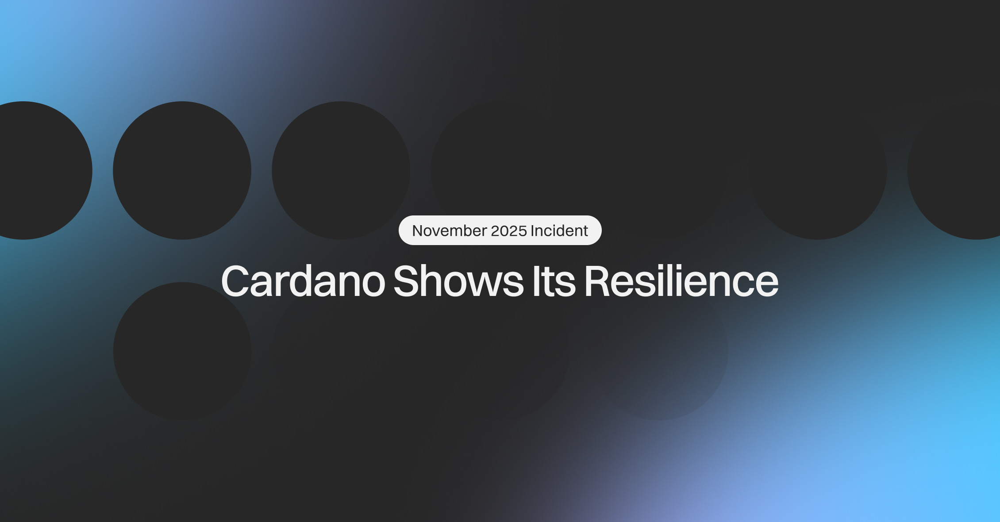

Giorgio Zinetti analyzed the November 21 incident, where a malformed transaction caused a temporary chain partition. Despite the split, block production continued uninterrupted, and the network remained online throughout. A coordinated response from SPOs and the Ouroboros consensus mechanism resolved the issue within 14 hours, demonstrating the network's resilience and decentralization.

 [**Read more**](https://cardanofoundation.org/blog/november-2025-cardano-shows-resilience) 

 

