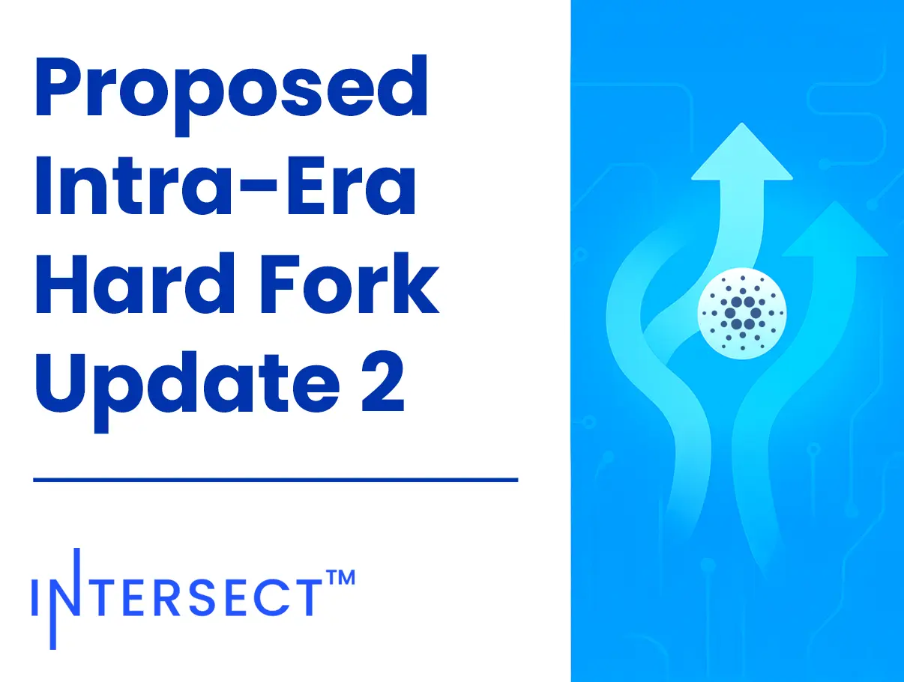

The December 04, 2025, blog post announces a proposed intra-era hard fork to Protocol Version 11. This upgrade introduces targeted improvements to Plutus performance, ledger consistency, and node security without transitioning to a new ledger era, ensuring a lower integration burden. Key changes include enhanced Plutus primitives, VRF key uniqueness enforcement, and revised reference input rules. Intersect will convene a Hard Fork Working Group to coordinate ecosystem readiness and feedback.

 [**Read more**](https://www.intersectmbo.org/news/proposed-intra-era-hard-fork-to-protocol-version-11) 

 

