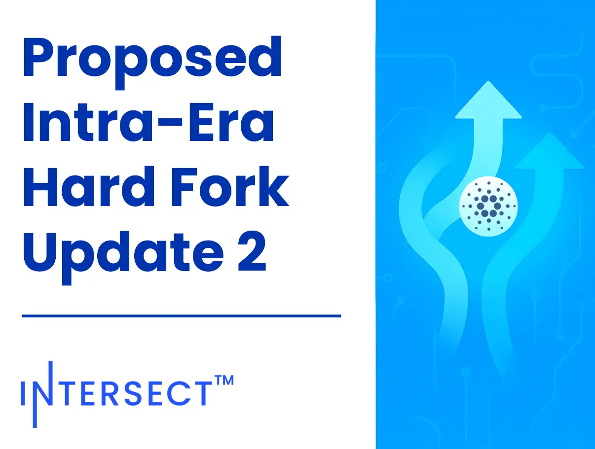

A proposed intra-era hard fork to Protocol Version 11 enhances Plutus performance, ledger consistency, and node security. This upgrade avoids an era transition to minimize integration burdens while introducing enhanced primitives, VRF key uniqueness, and updated reference input rules. Intersect is forming a working group to manage ecosystem readiness and feedback.

 [**Read more**](https://www.intersectmbo.org/news/proposed-intra-era-hard-fork-to-protocol-version-11) 

 

