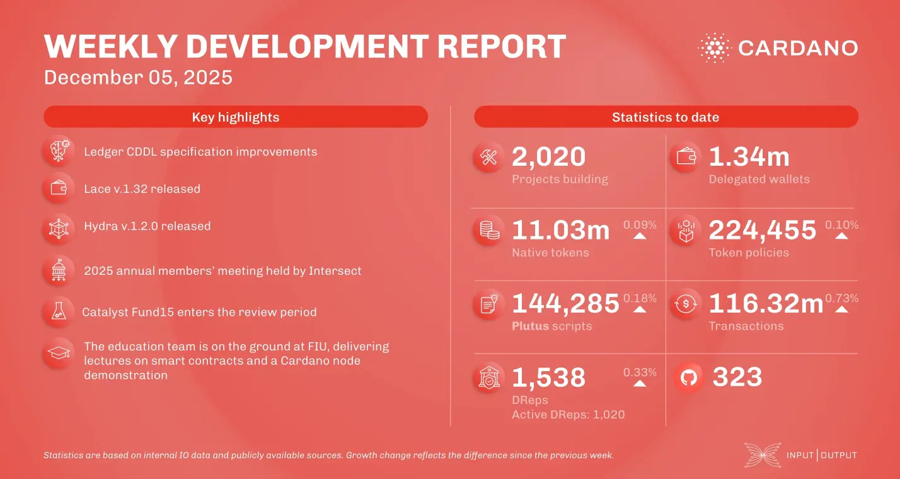

The December 5, 2025, development report highlights several key updates across the Cardano ecosystem. The ledger team finalized the Haskell definition and CDDL specification for nested transactions. Lace wallet v.1.32 was released, featuring a new notification center and allowing Midnight Foundation updates for NIGHT token holders. In scaling, the Hydra team released v.1.2.0 and implemented the 'SafeClose' feature, while Mithril advanced its SNARK-friendly STM library and aggregator discovery mechanism. Project Catalyst Fund15 moved into the community review phase with 761 proposals submitted. Additionally, Intersect hosted its 2025 Annual Members' Meeting in a virtual hub spanning 23 hours.

 [**Read more**](https://www.essentialcardano.io/development-update/weekly-development-report-as-of-2025-12-05) 

 

