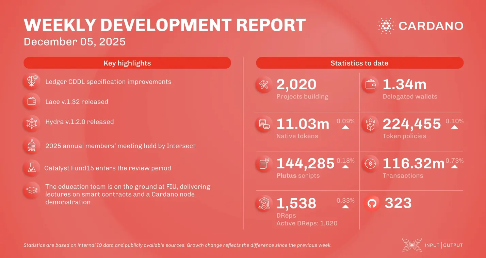

The ledger team finalized the specifications for nested transactions, while Lace v.1.32 launched with a new notification center and NIGHT token support. Hydra v.1.2.0 introduced the "SafeClose" feature, and Mithril advanced its SNARK-friendly STM library. Additionally, Project Catalyst Fund15 moved into community review with 761 proposals, and a 23-hour virtual Annual Members' Meeting was successfully hosted.

 [**Read more**](https://www.essentialcardano.io/development-update/weekly-development-report-as-of-2025-12-05) 

 

