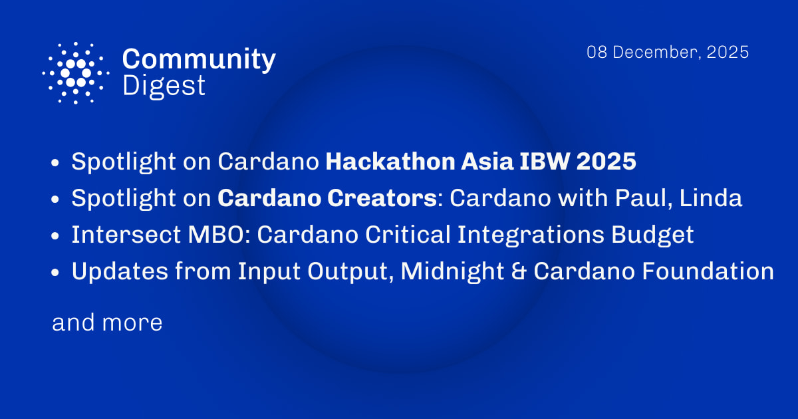

Der Community Digest vom 8. Dezember 2025 beleuchtet den ersten Cardano Hackathon Asia und das vorgeschlagene ₳70 Mio. Budget für kritische Integrationen. Input Output kündigt ein Rebranding sowie das Cavefish-Protokoll an, während Catalyst Fund15 in die Review-Phase eintritt. Zudem startete der Midnight NIGHT-Token offiziell als Cardano Native Asset.

 [**Read more**](https://forum.cardano.org/t/digest-december-08-2025-spotlight-on-cardano-hackathon-asia-ibw-2025-spotlight-on-cardano-creators-cardano-with-paul-linda-intersect-mbo-cardano-critical-integrations-budget-updates-from-input-output-midnight-cardano-foundation/151764) 

 

