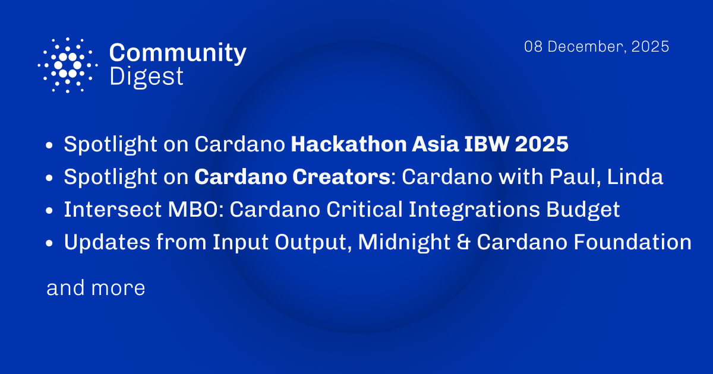

The Cardano Hackathon Asia and the proposed 70 million ada Critical Integrations Budget are featured in the December 8, 2025, digest. Input Output announced its rebranding to Input Output (IO) alongside the new Cavefish light client protocol. Catalyst Fund15 has entered the review phase, and the Midnight NIGHT token has officially launched as a Cardano Native Asset.

 [**Read more**](https://forum.cardano.org/t/digest-december-08-2025-spotlight-on-cardano-hackathon-asia-ibw-2025-spotlight-on-cardano-creators-cardano-with-paul-linda-intersect-mbo-cardano-critical-integrations-budget-updates-from-input-output-midnight-cardano-foundation/151764) 

 

