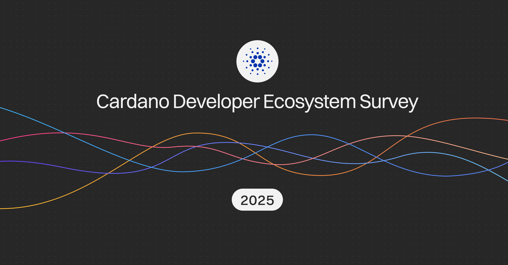

The December 11, 2025, blog post by Matthias Benkort presents the 2025 State of the Cardano Developer Ecosystem Survey results. With 109 responses, the survey highlights TypeScript, JavaScript, and Python as top proficiency languages, while over 75% of developers use Aiken for smart contracts. Key priorities include higher throughput (Leios) and improved documentation. Identity and authentication emerged as the primary focus for decentralized applications, surpassing DeFi and stablecoins.

 [**Read more**](https://cardanofoundation.org/blog/2025-developer-ecosystem-survey-results) 

 

