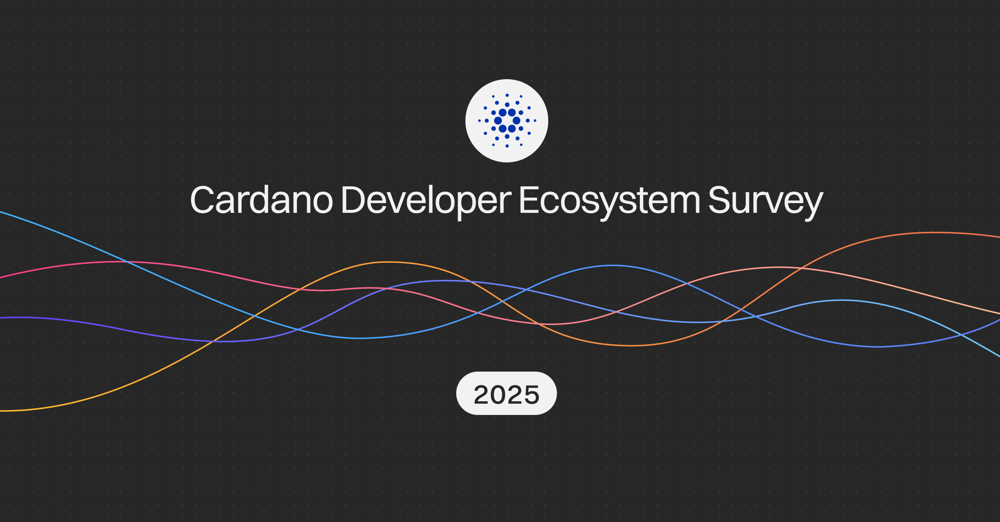

The 2025 State of the Cardano Developer Ecosystem Survey reveals a shift in developer priorities, with Identity and Authentication now the primary focus for DApps, overtaking DeFi and stablecoins. Key findings from the 109 respondents include TypeScript, JavaScript, and Python as the top proficiency languages, while Aiken has become the dominant smart contract tool, used by over 75% of developers. The community identified Ouroboros Leios (higher throughput) and improved documentation as the ecosystem's most pressing technical needs.

 [**Read more**](https://cardanofoundation.org/blog/2025-developer-ecosystem-survey-results) 

 

