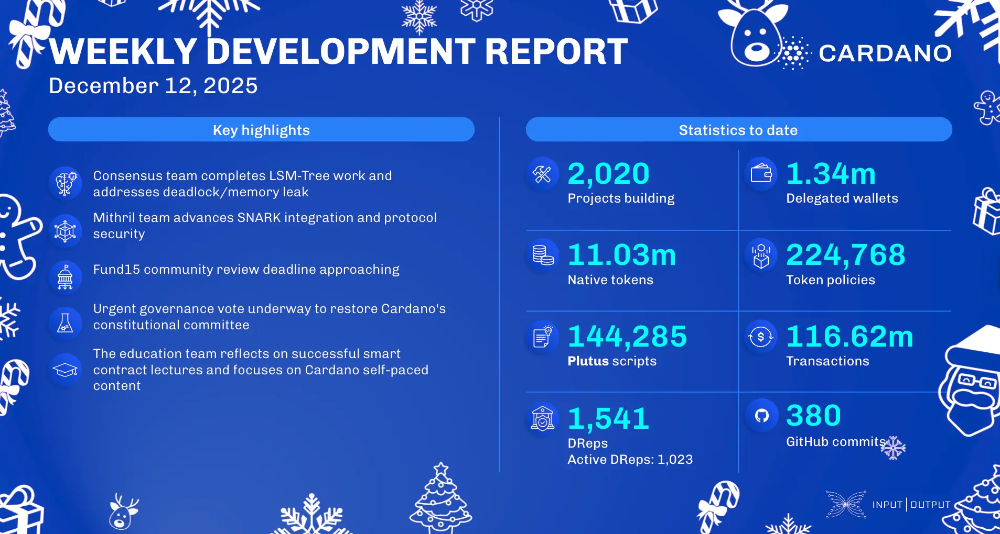

The final development report for 2025, dated December 12, highlights the approval of the Pyth Lazer oracle integration and Serviceplan Group joining Intersect as an enterprise member. The consensus team completed LSM-tree work, slated for integration in node v.10.7. Mithril made progress on its SNARK-friendly STM library and Bitcoin DeFi prover prototype. In governance, a critical vote is underway to restore the Constitutional Committee to full capacity, while Project Catalyst Fund15's community review period closes on December 15. The Midnight Redemption portal is live, and the NIGHT token is now trading on exchanges like Kraken.

 [**Read more**](https://www.essentialcardano.io/development-update/weekly-development-report-as-of-2025-12-12) 

 

