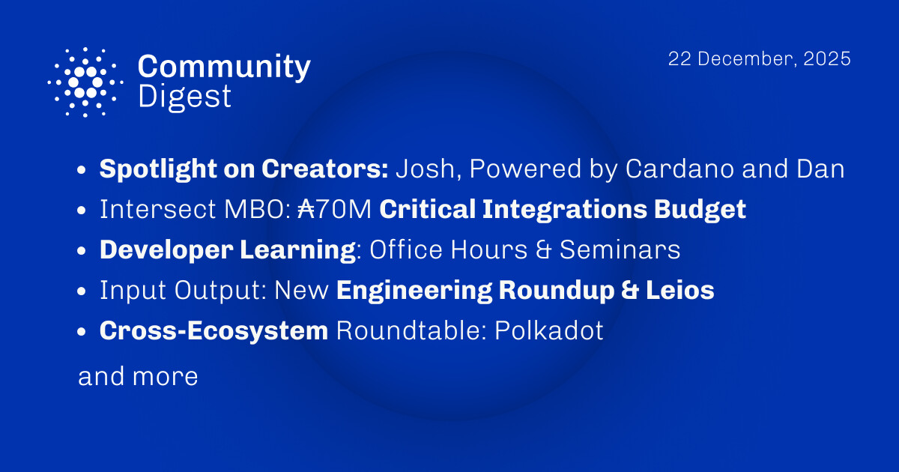

The December 22, 2025, Cardano Community Digest highlights Intersect MBO’s discussion on the 70 million ada Critical Integrations Budget and the first Cross-Ecosystem Roundtable with Polkadot regarding treasury sustainability. IO Global released its inaugural Engineering Roundup covering Leios and Hydra progress, while the ecosystem welcomed Aiken v1.1.21. Additionally, Intersect announced a partnership with Dune Analytics to integrate Cardano on-chain data, alongside the Cardano Foundation’s 2025 Governance Year in Review.

 [**Read more**](https://forum.cardano.org/t/digest-december-22-2025-spotlight-on-cardano-creators-josh-powered-by-cardano-dan-intersect-mbo-70m-critical-integrations-budget-developer-office-hours-seminars-io-global-new-2025-engineering-roundup-cross-ecosystem-roundtable-polkadot/152011) 

 

