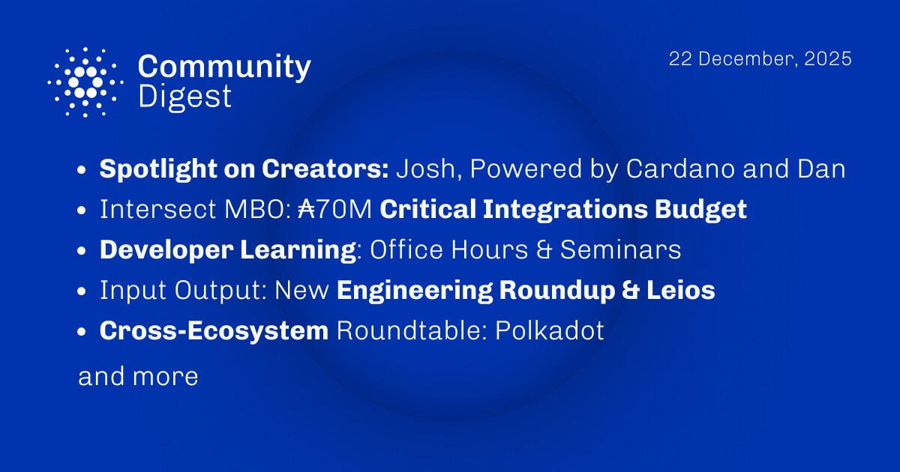

Intersect MBO discussed the 70M ada Critical Integrations Budget and held a treasury sustainability roundtable with Polkadot. IO Global launched its first Engineering Roundup on Leios and Hydra, while Aiken v1.1.21 was released. Dune Analytics will now integrate Cardano on-chain data, and the Cardano Foundation published its 2025 Governance Year in Review.

 [**Read more**](https://forum.cardano.org/t/digest-december-22-2025-spotlight-on-cardano-creators-josh-powered-by-cardano-dan-intersect-mbo-70m-critical-integrations-budget-developer-office-hours-seminars-io-global-new-2025-engineering-roundup-cross-ecosystem-roundtable-polkadot/152011) 

 

