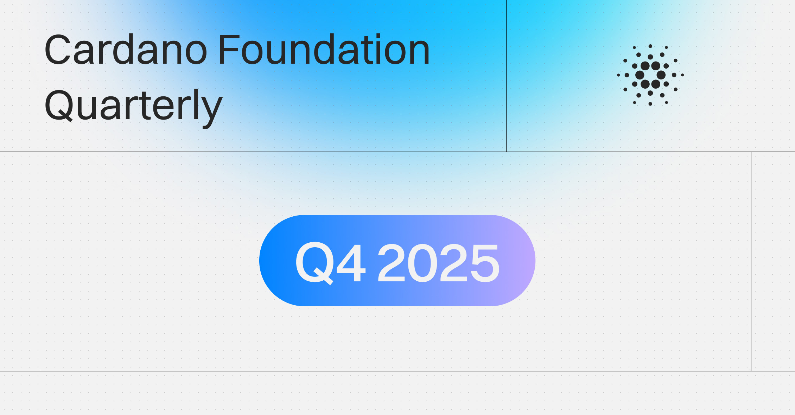

The December 30, 2025, quarterly report highlights the Foundation's Q4 focus on operational resilience and the successful transition to fully decentralized governance. Key milestones included the Cardano Summit 2025 in Berlin and expanded education through the Cardano Academy. The report also detailed the network's robust performance during a rare November incident and outlined continued efforts to position Cardano as critical public infrastructure for enterprise and institutional adoption.

 [**Read more**](https://cardanofoundation.org/blog/quarterly-q4-2025) 

 

