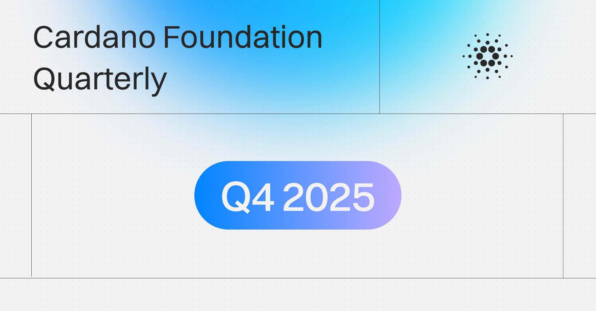

The Cardano Foundation's Q4 2025 report highlights operational resilience and the successful transition to fully decentralized governance. Key milestones include Cardano Summit 2025 in Berlin and the expansion of the Cardano Academy. The report also details the network's robust performance during a November incident and the ongoing strategy to position Cardano as critical public infrastructure for institutional adoption.

 [**Read more**](https://cardanofoundation.org/blog/quarterly-q4-2025) 

 

