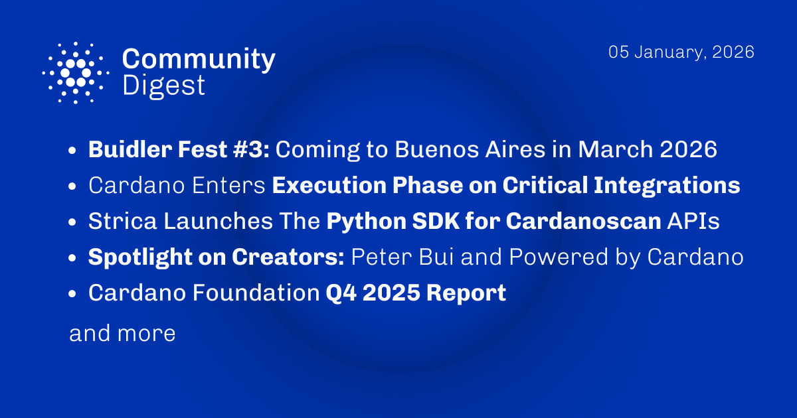

The January 06, 2026, Cardano Community Digest highlights the announcement of Buidler Fest 3, scheduled for March 2026 in Buenos Aires, Argentina. The ecosystem has entered the execution phase for the Critical Integrations Budget, funding key projects like Pyth Network and Dune. Team Strica released a Python SDK for Cardanoscan APIs to improve developer access, while the Cardano Foundation published its Q4 2025 report detailing adoption and governance milestones.

 [**Read more**](https://forum.cardano.org/t/digest-january-06-2026-buidler-fest-3-coming-to-buenos-aires-in-march-2026-cardano-enters-execution-phase-on-critical-integrations-python-sdk-for-cardanoscan-apis-spotlight-on-peter-bui-and-powered-by-cardano-cardano-foundation-q4-2025-report/152346) 

 

