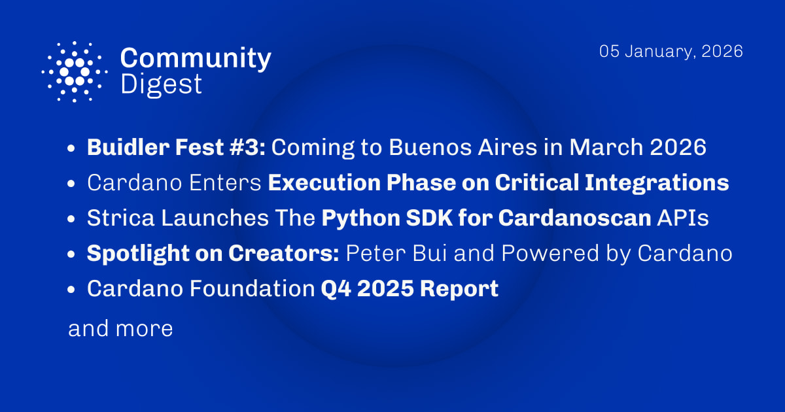

Buidler Fest 3 is coming to Buenos Aires in March 2026. Simultaneously, the Critical Integrations Budget has entered its execution phase, funding major projects like Pyth Network and Dune. Team Strica released a Python SDK for Cardanoscan APIs to boost developer accessibility, and the Cardano Foundation’s Q4 2025 report was published, detailing key adoption and governance milestones.

 [**Read more**](https://forum.cardano.org/t/digest-january-06-2026-buidler-fest-3-coming-to-buenos-aires-in-march-2026-cardano-enters-execution-phase-on-critical-integrations-python-sdk-for-cardanoscan-apis-spotlight-on-peter-bui-and-powered-by-cardano-cardano-foundation-q4-2025-report/152346) 

 

