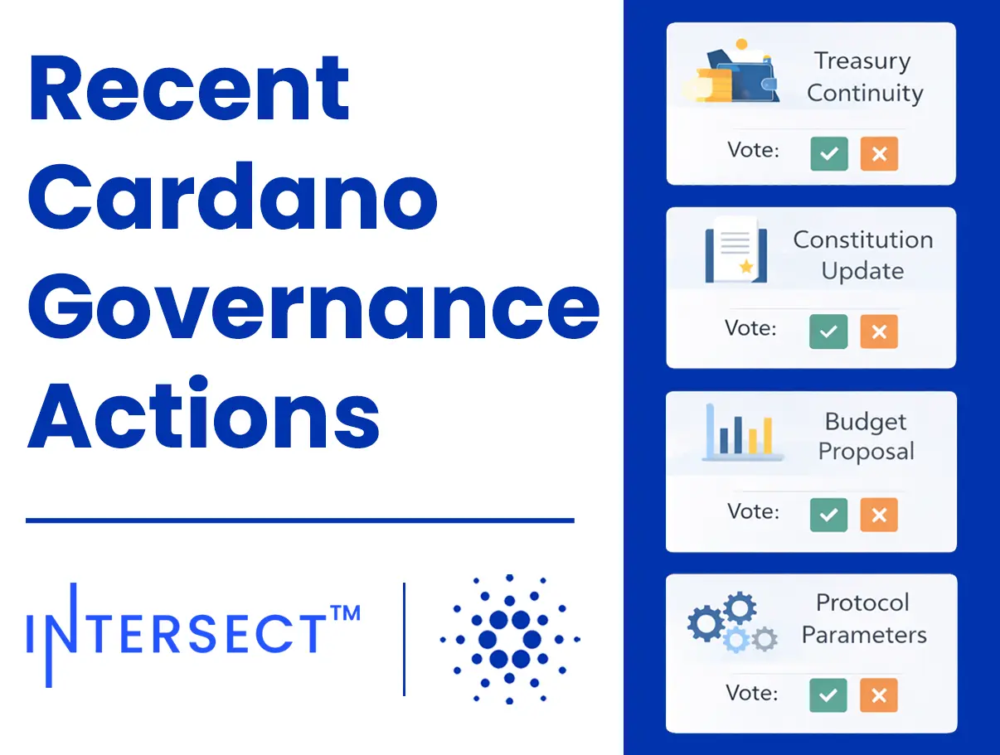

The January 09, 2026, Intersect report highlights the ratification of a Net Change Limit extension, ensuring treasury continuity. With the election of Cardano Curia, the Constitutional Committee has been restored to full functionality. Active proposals now include adding Christina Gianelloni as an eighth committee member, the Cardano 2030 Vision strategy, and Constitution v2.4, which aims to improve enforceability and remove non-binding clauses from the governing document.

 [**Read more**](https://www.intersectmbo.org/news/recent-cardano-governance-actions) 

 

