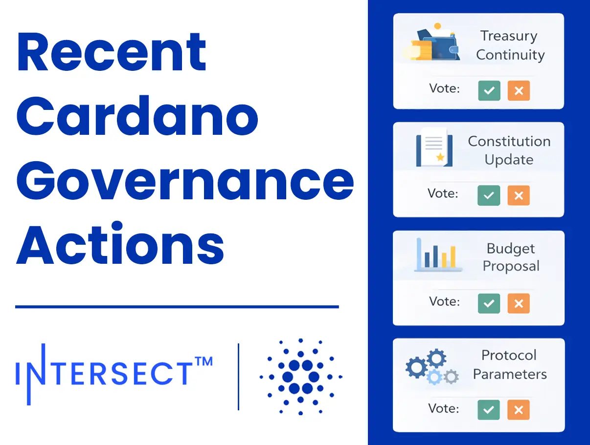

The Net Change Limit extension was ratified to ensure treasury continuity, while the election of Cardano Curia restored the Constitutional Committee. Current proposals include adding Christina Gianelloni as an eighth member, the Cardano 2030 Vision strategy, and Constitution v2.4. This version aims to improve enforceability and remove non-binding clauses from the governing document.

 [**Read more**](https://www.intersectmbo.org/news/recent-cardano-governance-actions) 

 

