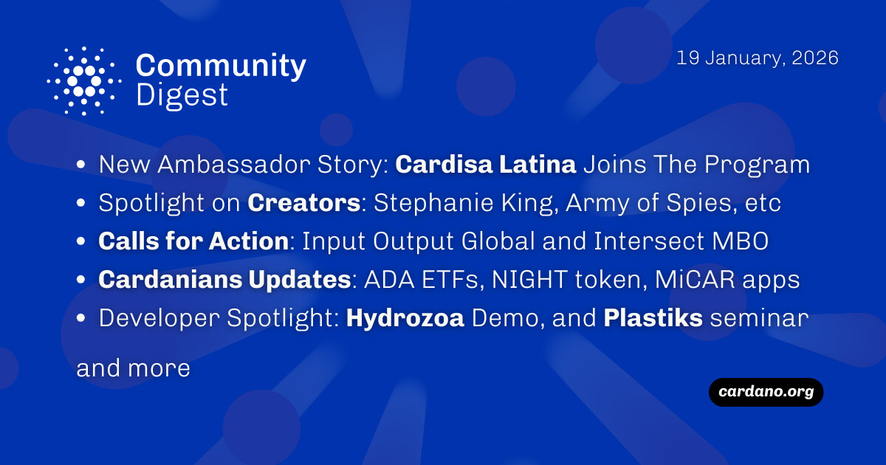

The January 19, 2026, Cardano Community Digest highlights the "Amplify Cardano" initiative by Rare Network, offering funding for events and marketing. Cardisa Latina was welcomed as a new ambassador, while the spotlight shone on creators Stephanie King, Army of Spies, and Linda. Intersect MBO announced the naming of the upcoming "van Rossem" hard fork, and developers engaged with Hydrozoa demos and a Plastiks seminar on fighting greenwashing.

 [**Read more**](https://forum.cardano.org/t/digest-january-19-2026-cardisa-latina-ambassador-story-spotlight-on-creators-stephanie-king-army-of-spies-linda-calls-for-action-iog-and-intersect-mbo-cardanians-weekly-update-developer-engagement-hydrozoa-demo-and-plastiks-seminar/152637) 

 

