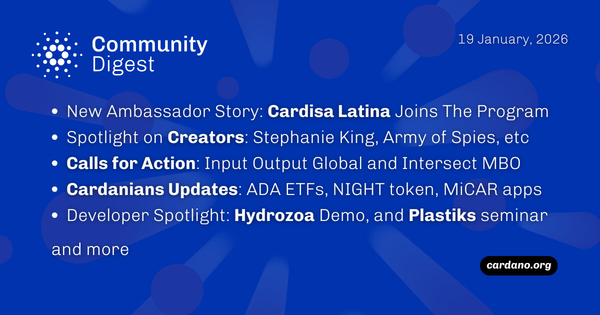

The "Amplify Cardano" initiative by Rare Network now provides funding for community events and marketing. Cardisa Latina joined as a new ambassador, while Intersect announced the "van Rossem" hard fork as the next major upgrade. Additionally, the community engaged with Hydrozoa demos and a Plastiks seminar focused on leveraging the ledger to combat greenwashing.

 [**Read more**](https://forum.cardano.org/t/digest-january-19-2026-cardisa-latina-ambassador-story-spotlight-on-creators-stephanie-king-army-of-spies-linda-calls-for-action-iog-and-intersect-mbo-cardanians-weekly-update-developer-engagement-hydrozoa-demo-and-plastiks-seminar/152637) 

 

