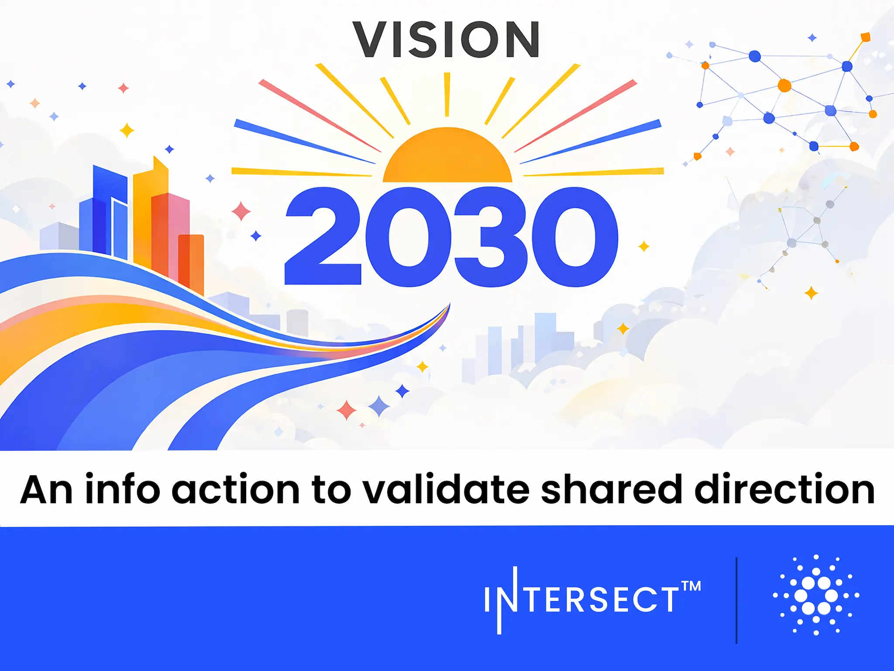

Cardano 2030 Vision passed with 67.8% approval (3.77B ada). This non-binding framework, built by 700+ community members, focuses on adoption, governance, and sustainability. It defines Cardano as the premier choice for mission-critical applications, providing a strategic roadmap to align future ecosystem development and technical priorities.

 [**Read more**](https://www.intersectmbo.org/news/cardano-2030-an-info-action-to-validate-shared-direction) 

 

