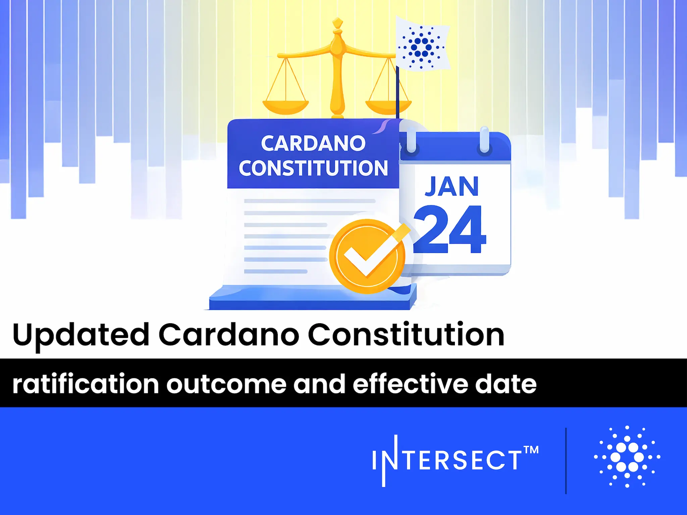

The January 22, 2026, Intersect report highlights the ratification of the updated Cardano Constitution, which received support from 79% of active voting stake. The new constitution takes effect at the epoch boundary on January 24, introducing stricter standards for governance actions, such as mandatory immutable links for off-chain documents. Additionally, budget info actions are no longer constitutionally recognized, requiring treasury withdrawals to be fully self-contained.

 [**Read more**](https://www.intersectmbo.org/news/updated-cardano-constitution-ratification-outcome-and-effective-date) 

 

