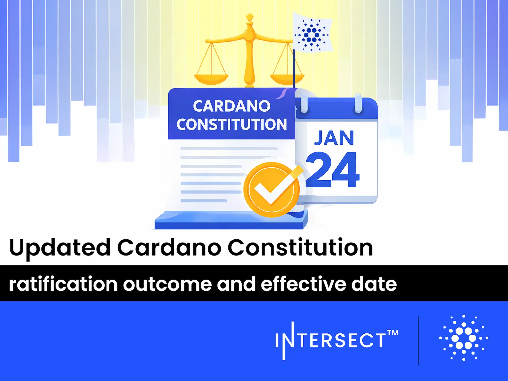

The Cardano Constitution is ratified with 79% support, taking effect January 24. It introduces stricter standards, including mandatory immutable links for off-chain documents. Importantly, budget info actions are no longer recognized; all ada treasury withdrawals must now be fully self-contained. These changes prioritize transparency and standalone accountability for every governance proposal within the ecosystem.

 [**Read more**](https://www.intersectmbo.org/news/updated-cardano-constitution-ratification-outcome-and-effective-date) 

 

