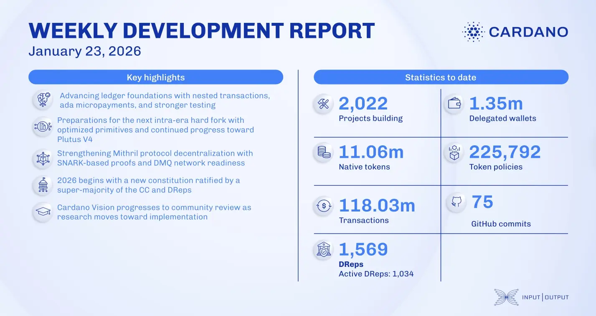

The January 23, 2026, development report highlights the ratification of the updated Cardano constitution, effective January 24. On the core technology front, the ledger team finalized the design for nested transactions (CIP-118) and began implementing account address enhancements (CIP-159) for the Dijkstra era. Additionally, the Mithril team focused on SNARK-friendly libraries and prepared infrastructure for the decentralized message queue (DMQ) network deployment.

 [**Read more**](https://www.essentialcardano.io/development-update/weekly-development-report-as-of-2026-01-23) 

 

