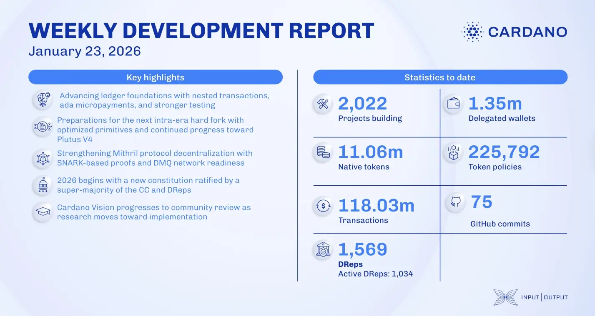

The updated Cardano constitution has been ratified and officially took effect on January 24, marking a pivotal step in decentralized governance. The ledger team finalized the design for nested transactions (CIP-118) and began implementing account address enhancements (CIP-159) for the upcoming Dijkstra era. Simultaneously, the Mithril team focused on SNARK-friendly libraries and prepared the infrastructure for the decentralized message queue (DMQ) network deployment.

 [**Read more**](https://www.essentialcardano.io/development-update/weekly-development-report-as-of-2026-01-23) 

 

