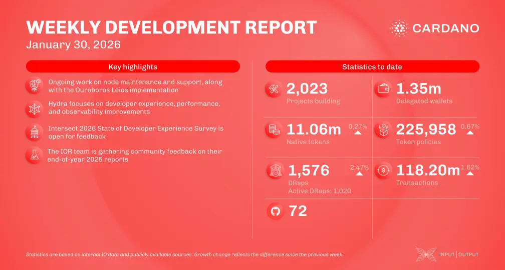

The January 30, 2026, development report highlights the consensus team's work on Cardano node v.10.7 and the prototyping of Leios endorsement block production. The Hydra team focused on performance improvements and the Raspberry Pi demo, while the Mithril team prepared the pre-release for the 2603.1-pre distribution, introducing support for the DMQ protocol. Additionally, Intersect is facilitating an intra-era upgrade to protocol version 11.

 [**Read more**](https://www.essentialcardano.io/development-update/weekly-development-report-as-of-2026-01-30) 

 

