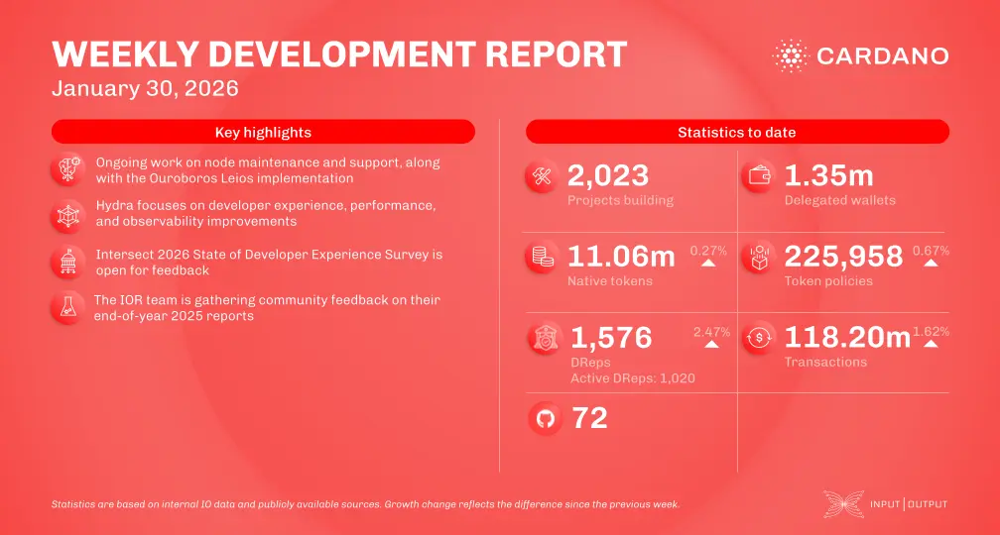

Cardano node v.10.7 development and Leios endorsement block prototyping are advancing, pushing the network toward higher throughput. The Hydra team focused on performance optimizations and a Raspberry Pi demo, while Mithril prepared distribution 2603.1-pre with DMQ protocol support. Furthermore, Intersect is coordinating an intra-era upgrade to protocol version 11, laying the groundwork for enhanced governance and scalability features.

 [**Read more**](https://www.essentialcardano.io/development-update/weekly-development-report-as-of-2026-01-30) 

 

