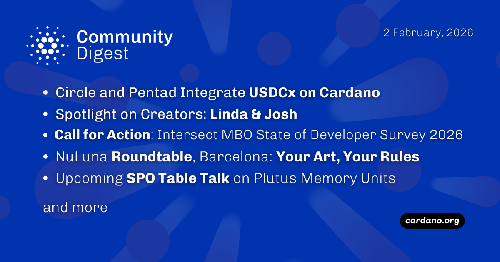

The February 02, 2026, Cardano Community Digest highlights the agreement between Circle and the Cardano Pentad to integrate USDCx on Cardano, a deliverable from the Critical Infrastructure Budget. The update features content creators Linda and Josh, the launch of the open-source governance platform CGOV by Mesh, and Intersect MBO’s State of Developer Experience Survey. Additionally, the digest details the NuLuna Roundtable in Barcelona and an SPO Table Talk on Plutus memory limits.

 [**Read more**](https://forum.cardano.org/t/digest-february-2-2026-circle-and-pentad-integrate-usdcx-on-cardano-spotlight-linda-josh-call-for-action-intersect-mbo-state-of-developer-survey-2026-nuluna-roundtable-barcelona-your-art-your-rules-upcoming-spo-table-talk-feb-2nd/152962) 

 

