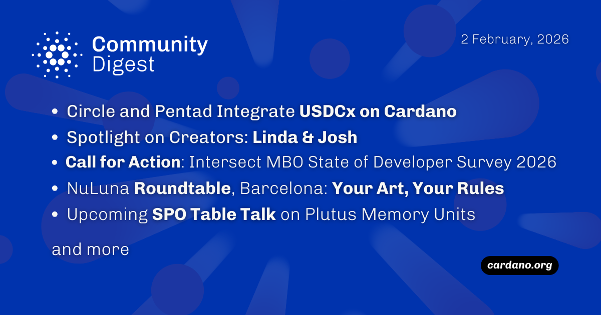

USDCx is coming to Cardano through an agreement between Circle and the Cardano Pentad, funded via the Critical Infrastructure Budget. Mesh has launched CGOV, an open-source governance platform, while Intersect released its State of Developer Experience Survey. The community also focused on technical optimization through the NuLuna Roundtable in Barcelona and an SPO Table Talk addressing critical Plutus memory limits.

 [**Read more**](https://forum.cardano.org/t/digest-february-2-2026-circle-and-pentad-integrate-usdcx-on-cardano-spotlight-linda-josh-call-for-action-intersect-mbo-state-of-developer-survey-2026-nuluna-roundtable-barcelona-your-art-your-rules-upcoming-spo-table-talk-feb-2nd/152962) 

 

