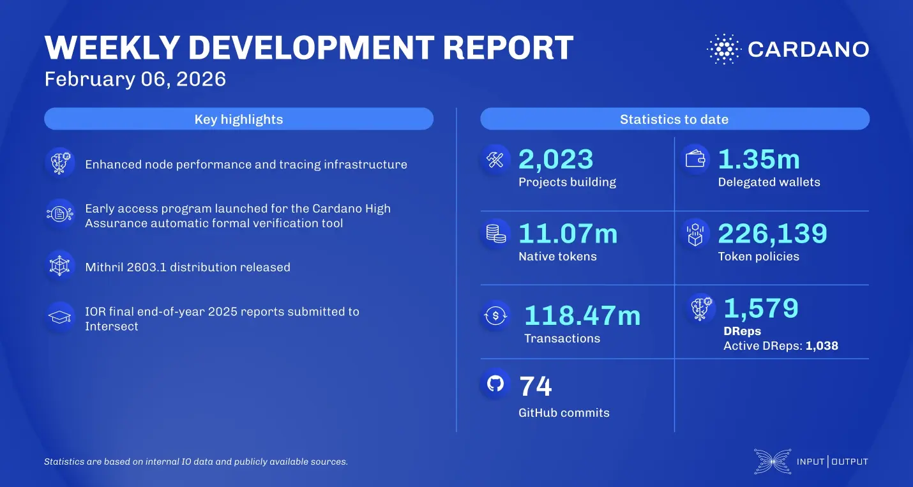

The February 06, 2026, development report highlights the High Assurance team's launch of the automatic formal verification tool early access program, inviting developers to shape security tooling. In scaling news, the Mithril team released distribution 2603.1, adding support for the decentralized message queue protocol and a Blockfrost API integration. Additionally, the Input Output Research team submitted final end-of-year 2025 reports to Intersect, closing Work Package 25.

 [**Read more**](https://www.essentialcardano.io/development-update/weekly-development-report-as-of-2026-02-06) 

 

