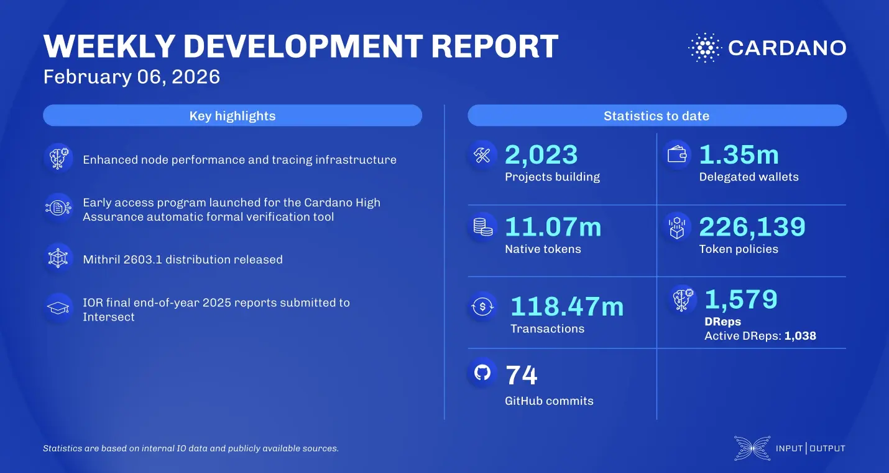

The High Assurance team has launched an early access program for its automatic formal verification tool, inviting developers to help shape the future of smart contract security. In scaling updates, Mithril distribution 2603.1 is now available, featuring a decentralized message queue protocol and Blockfrost API integration. Furthermore, the IOG Research team officially closed Work Package 25 by submitting its comprehensive 2025 end-of-year reports to Intersect.

 [**Read more**](https://www.essentialcardano.io/development-update/weekly-development-report-as-of-2026-02-06) 

 

