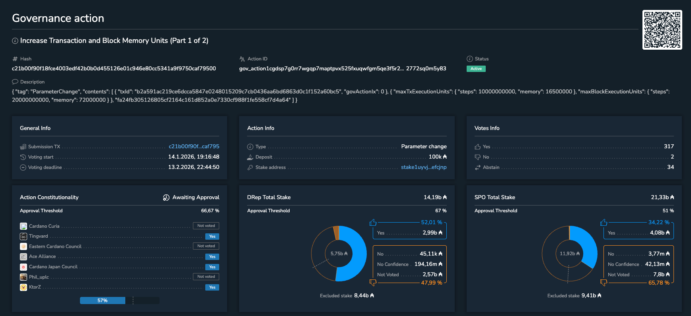

The February 10, 2026, Call to Action reminds SPOs and DReps there are only three days left to vote on the currently active Protocol Parameter Update, which improves Plutus execution limits. The update expands application capabilities by allowing more logic per transaction, optimizes block usage for higher throughput, and helps the network stay ahead of growing demand. SPOs and DReps are encouraged to review the proposal, and the recent SPO Roundtable discussion, before casting their vote.

 [**Read more**](https://forum.cardano.org/t/call-to-action-for-spos-and-dreps-participate-in-the-active-protocol-parameter-change-governance-action-on-plutus-execution-limits/153102) 

 

