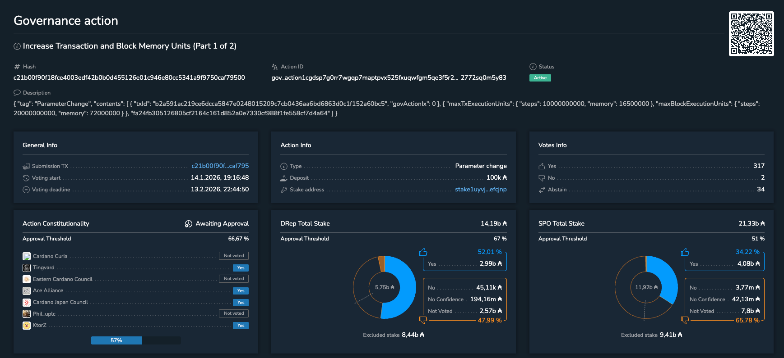

SPOs and DReps have three days remaining to vote on the Protocol Parameter Update to increase Plutus execution limits. This update scales DApp capabilities by allowing more logic per transaction while optimizing block usage for higher throughput. Stakeholders are encouraged to review the formal proposal and the recent SPO Roundtable discussion to ensure the network continues to meet growing demand.

 [**Read more**](https://forum.cardano.org/t/call-to-action-for-spos-and-dreps-participate-in-the-active-protocol-parameter-change-governance-action-on-plutus-execution-limits/153102) 

 

