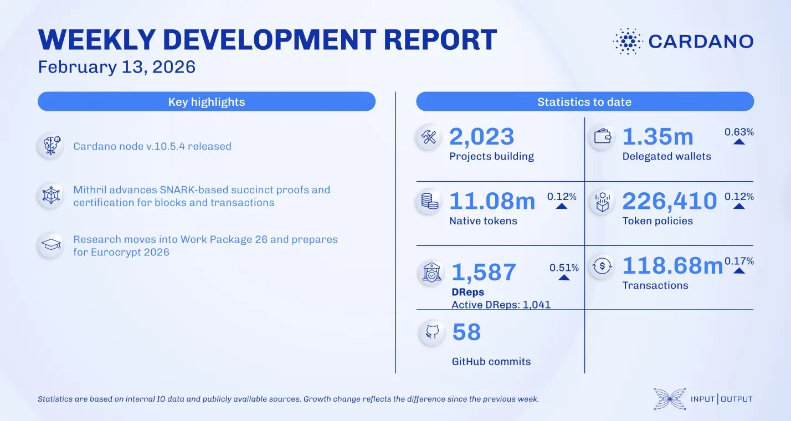

The February 13, 2026, development report highlights the networking team's release of node v.10.5.4, which enhances the diffusion layer with essential patches. The consensus team integrated network packages for node v.10.7 and further advanced the Leios prototype. On the scaling front, the Mithril team implemented new succinct proofs and SNARK-friendly certificate chains, while the Leios team moved toward finalizing protocol parameter recommendations through extensive simulations and research.

 [**Read more**](https://www.essentialcardano.io/development-update/weekly-development-report-as-of-2026-02-13) 

 

