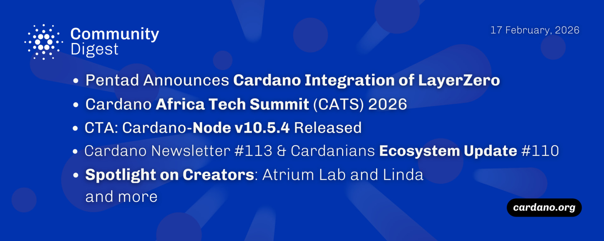

LayerZero integration has been approved, connecting the network to over 150 blockchains to expand cross-chain liquidity. The Cardano Africa Tech Summit in Nairobi showcased regional adoption, while node v10.5.4 introduced critical networking enhancements for resilience. Additionally, the Midnight mainnet is on track for a late March launch, coinciding with the official debut of ada futures on the CME Group exchange.

 [**Read more**](https://forum.cardano.org/t/digest-february-17-2026-pentad-announces-cardano-integration-of-layerzero-cardano-africa-tech-summit-2026-cardano-node-v10-5-4-released-ecosystem-updates-from-cardano-newsletter-cardanians-spotlight-on-creators-atrium-lab-and-linda/153224) 

 

