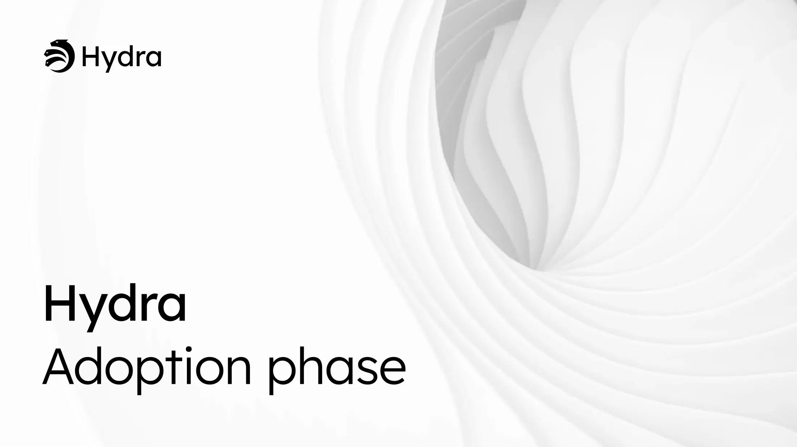

The February 20, 2026, development report highlights the transition of Hydra into its adoption phase, focusing on production feedback and real-world use cases. The core team advanced version 1.3, which introduces fee calculation fixes, memory optimizations, and partial fan-out functionality. Notable projects like DeltaDeFi and Masumi demonstrated how Hydra enables high-performance trading and scalable micropayments, while the working group prioritized infrastructure hardening and improved developer experience.

 [**Read more**](https://www.iog.io/news/hydra-adoption-phase) 

 

